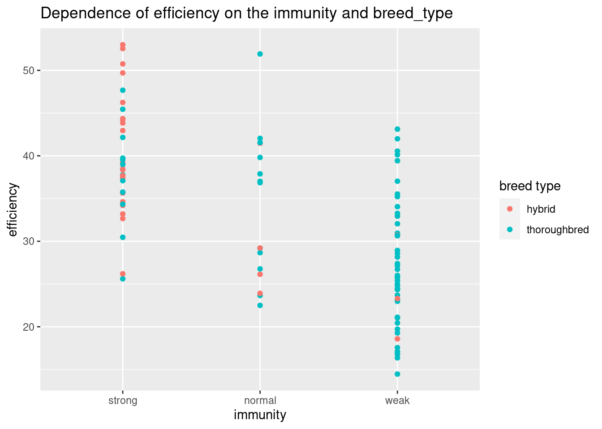
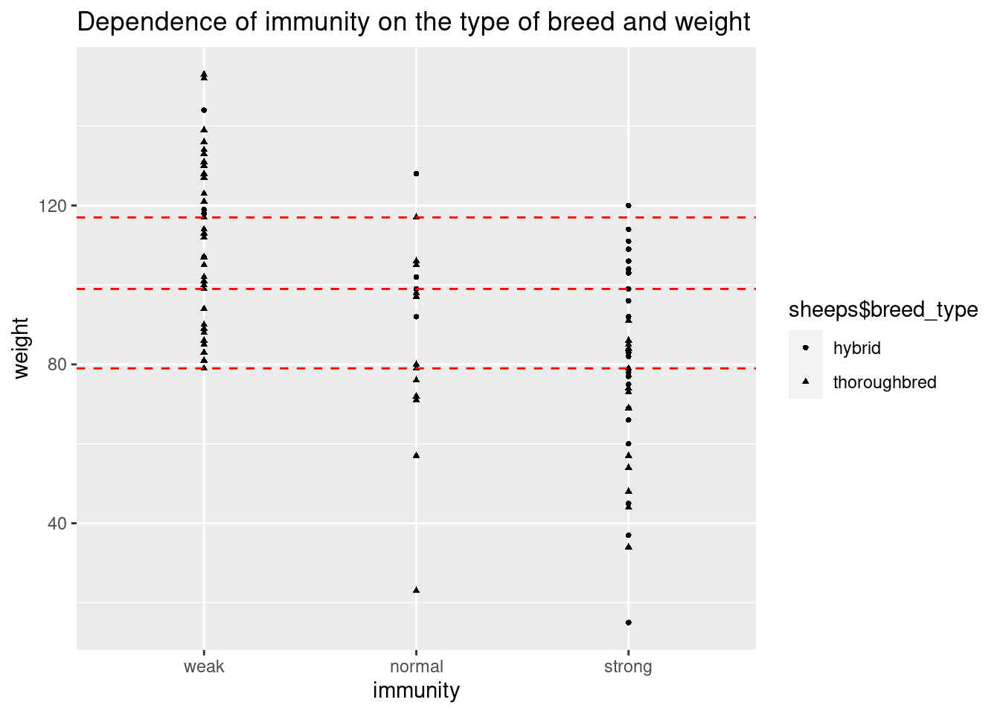
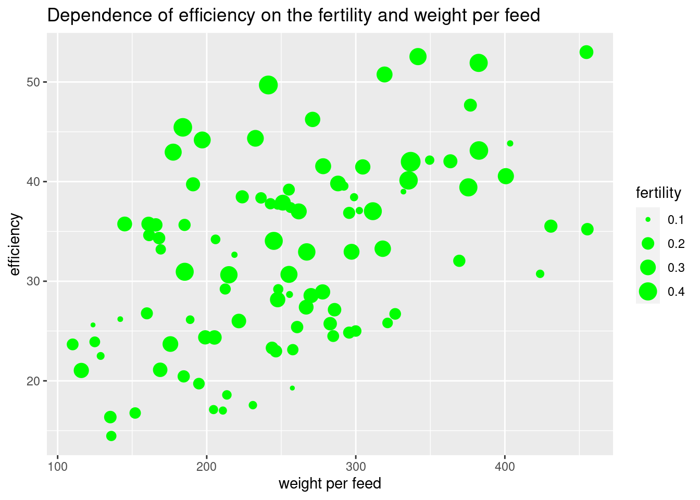

# Generation of training data for analysis and model creation

[complete data set](sheep-efficiency_clean.csv)

[data set where some values are empty](sheep-efficiency_na.csv) (to try to generate)

## Data description

estimated parameters:
```
name - Sheep breed name
weight_male - Male weight (kg)
weight_female - Female weight (kg)
meat_result - Meat result (% from the weight)
weight_per_feed - Live weight gain per kilogram of feed (kg)
fertility - Fertility (%) (where 100% is one lamb)
availability_in_poland - Presence of a breeder of this breed in the country (true, false)
breed_type - Breed type (thoroughbred, hybrid)
immunity - Immunity (weak, normal, strong)
efficiency - Sheep breed efficiency index
```

parameters affecting generation:
```
females are always lighter than males
lighter and hybrid breeds sheep have better immunity
```

parameters that most influence efficiency:
```
fertility
immunity
meat_result
```

## Graphs showing dependencies





## Used instruments:
```
R programming language
Tideverse library
```
